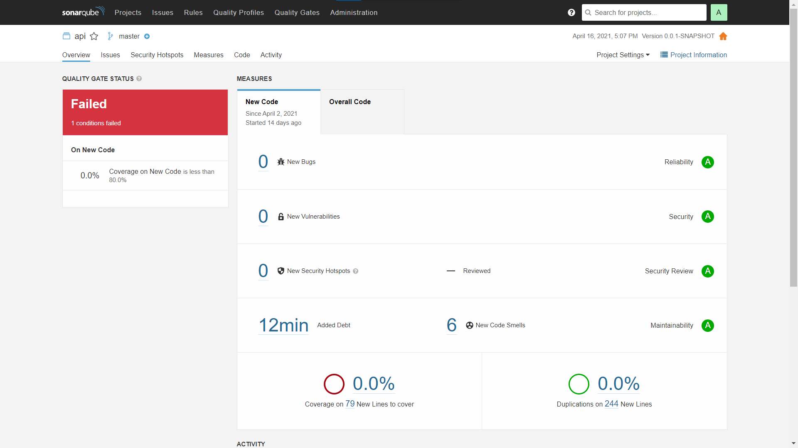
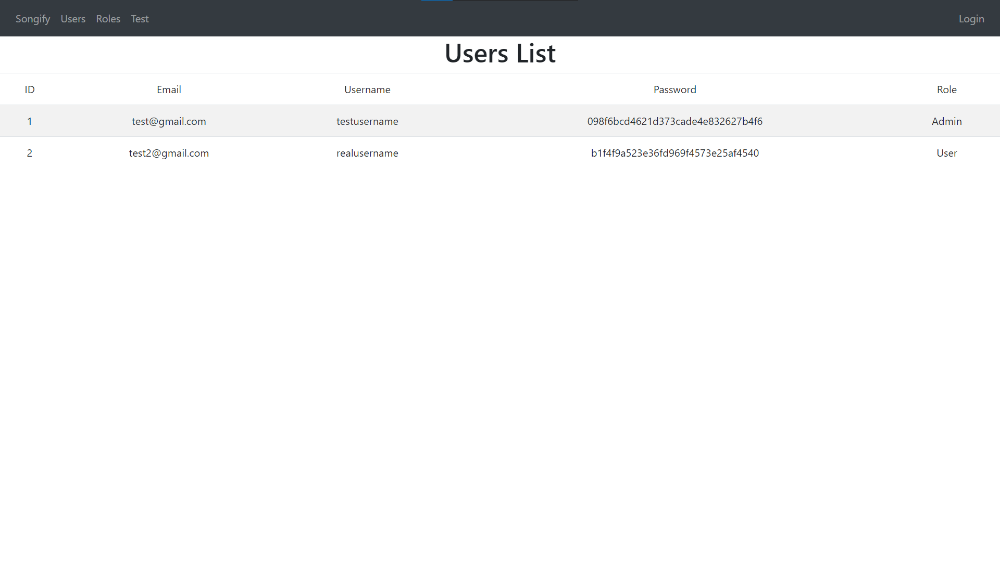
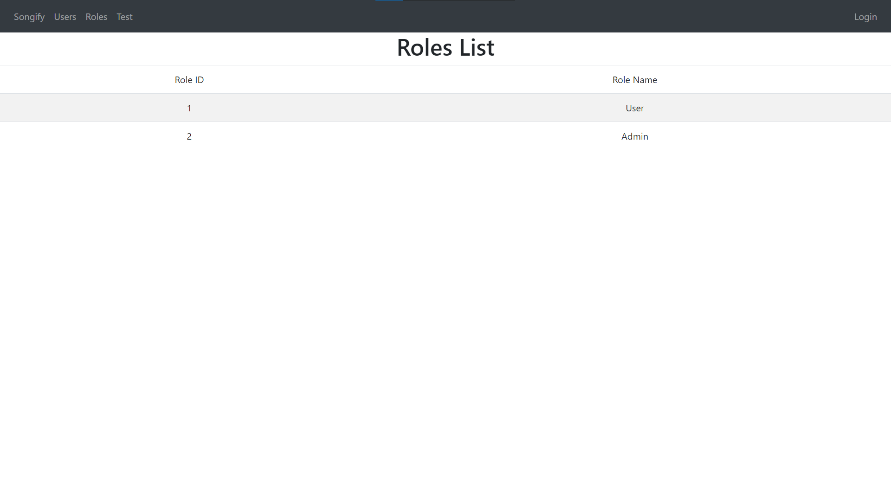
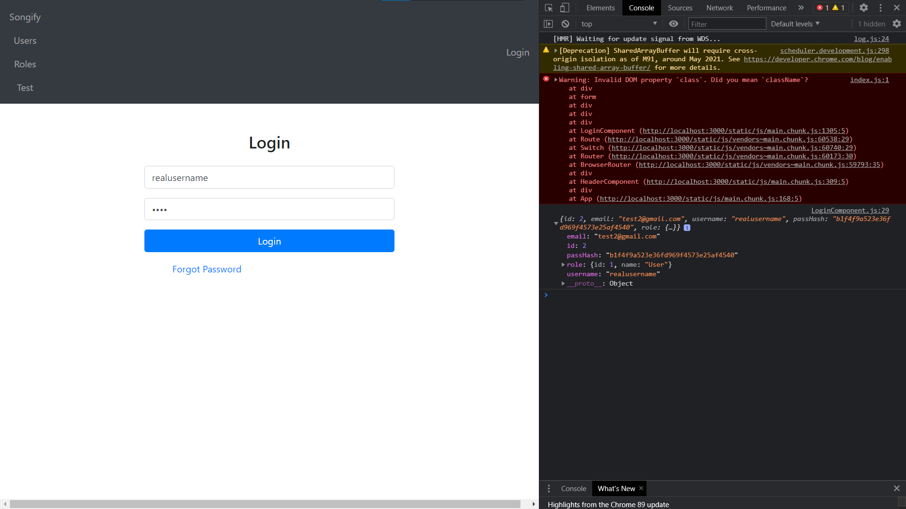
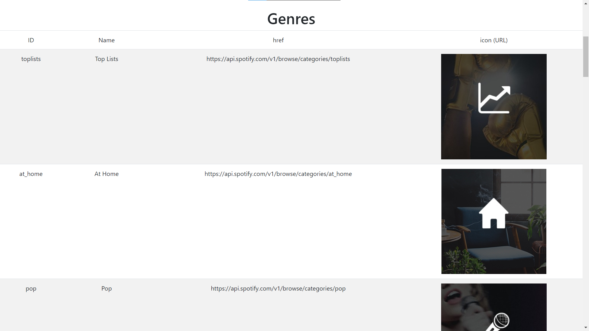
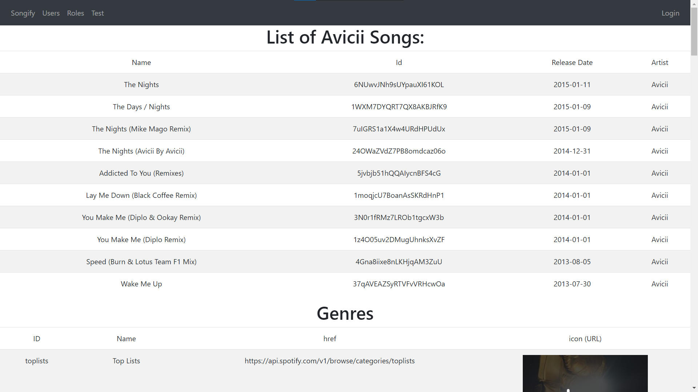

Songify, playlist creating and sharing website

Due to a lack of unit test/unit test coverage, the quality gate status will stay failed, however reliability, security, security hotspots and maintainability are all A.

Sonarqube Screenshot:

Backend Connectivity Screenshots:

Users List:
This list of users is retrieved from my own API

Roles List:
This list of roles is also retrieved from my own API

Login Progress:
Due to finding out about single sign on options and unfamiliarity with React, the login only logs user details into the console if the detail are correct.

Genres List:
This list of genres is retrieved from the Spotify API with a given client id and secret which can be used to retrieve a token

Avicii Songs:
This list of songs is retrieved from the Spotify API also and in the request it was specified that i only wanted songs from Avicii
