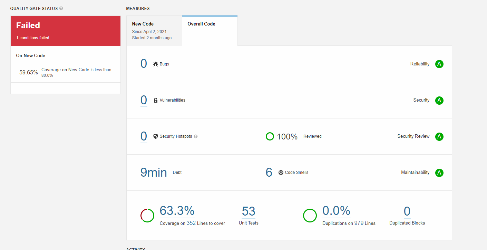
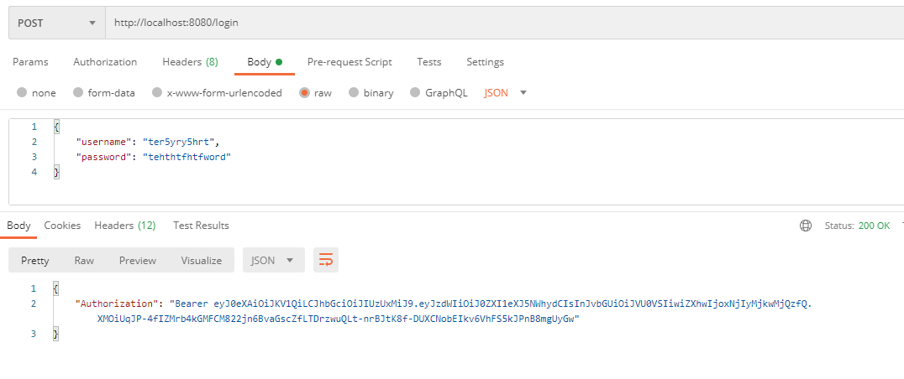
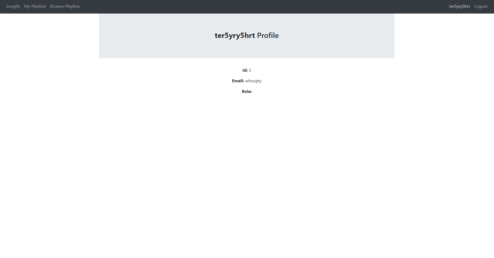
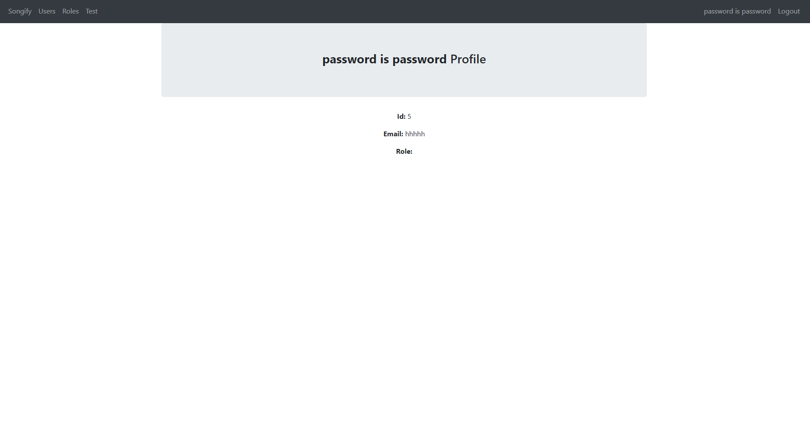
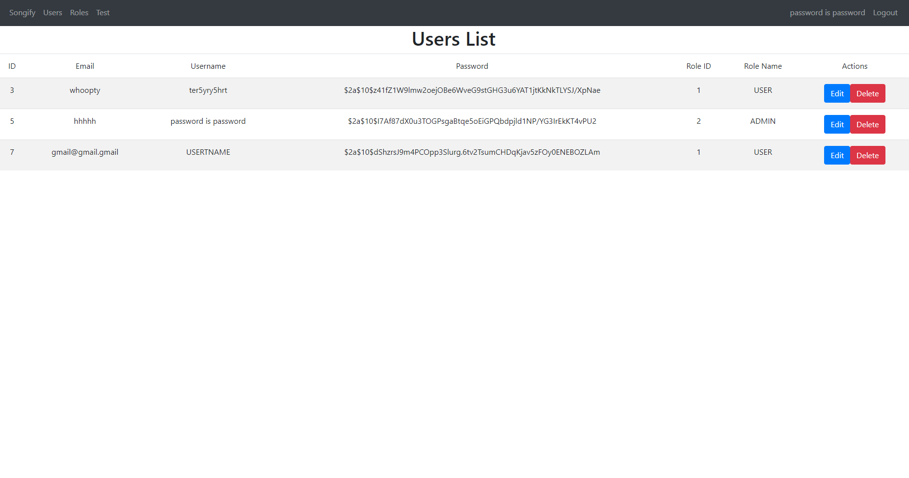
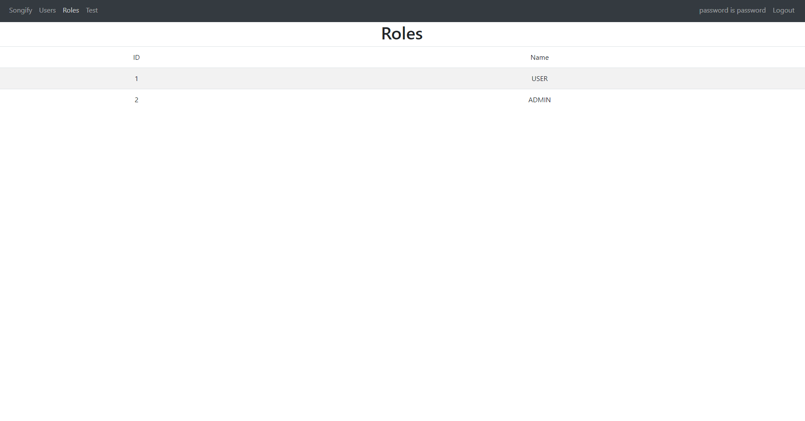

Songify, playlist creating and sharing website

Due to a lack of unit test/unit test coverage, the quality gate status will stay failed, however reliability, security, security hotspots and maintainability are all A.

Sonarqube Screenshot:

Backend Connectivity Screenshots:

Bearer Authentication:

The logic for generation, authorizing and giving JWT tokens to a user exists, but using this generated token in the front-end as a request header to authorize requests is still work in progress, therefore I have added a postman screenshot to show the token being given when a correct username and password are supplied.

Login:

In the previous sprint, the following screenshot represented the progress made for login:

However, in the 4th sprint the information that is sent to the console is now stored in the browser meaning any component, such as the nav bar, can access it, this is how the application keeps track of who is logged in, and if they have permission to open a certain page (e.g. logged in users are redirected to the home page when trying to access the login page again). The following screenshots show a user and an admin being logged in, and the two different navigation bars they receive.

Users List:
The list of users is now only accessable by logged in admins, and also has the option to edit or delete a user

Roles List (Same as sprint 3):
The list of roles has stayed the same except for the fact that only admins can see it

