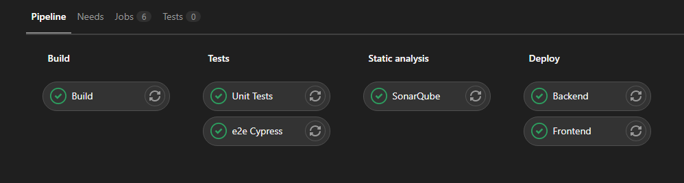
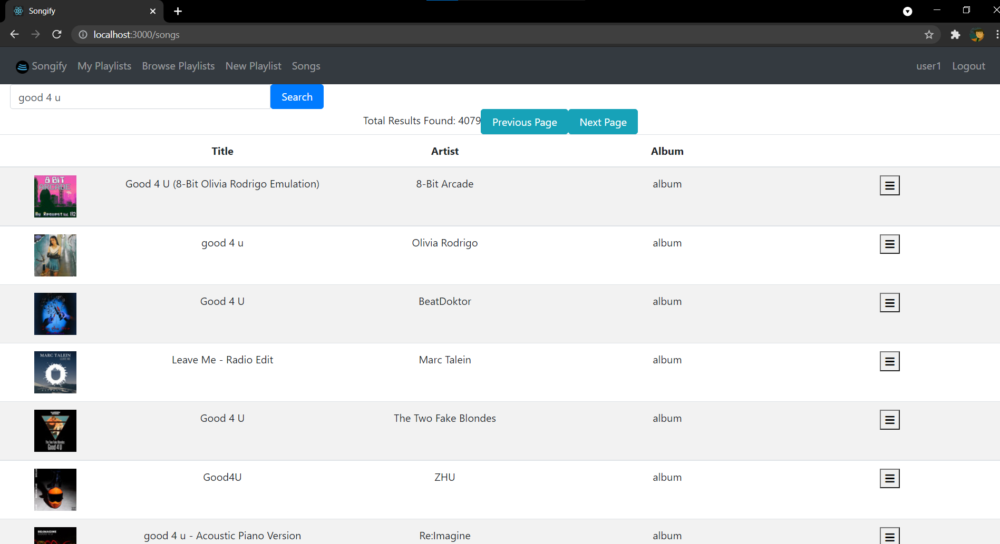

Songify, playlist creating and sharing website

# Sprint 5

During the last few sprints, I would put images of progress and reports in the readme, for this Sprint, the progress can be seen in the UX Feedback Report.

For the reports, I added a test report document inside of the documentation folder which details which tests were run, how they were run and the results from those tests.

Inside of the documentation folder are also my security document detailing the OWASP Top 10 risks, the updated UX Feedback Report detailing the steps now taken since the last sprint with images and all documents from the previous sprints.

## Other sprint 5 additions not discussed in documents:

#### Docker
This sprint I also implemented docker into my CI/CD Pipeline. Once code is pushed to the repository the docker build and docker push commands are automatically executed inside of the 'Deploy' stage

The links to the docker images pushed to Docker Hub:
Backend: https://hub.docker.com/r/davekhaki/songifybackend
Frontend: https://hub.docker.com/r/davekhaki/songifyfrontend

Note: A MySQL image with username "root" and password "Password1234" is also required if you want to run the application through containers.

#### Spotify Api Integration
Something that I had already started testing out during the second sprint was retrieving information from the Spotify Api. After two sprints focused on other features, documentation and testing I've finally implemented a search feature. It sends a request to the Spotify Api and shows a list of songs based on the response. The next steps is to finish the menu that calls the REST Api to add the song to a selected playlist. The endpoint and logic for this user story are already complete and requests through Postman give the expected result. In the following picture you can see a search bar, the term used to search for and the table full of responses. The next and previous page send more calls to retrieve the next/ previous 10 songs if available. The burger button on the right of each song opens the menu to add the selected song to a specific playlist.
